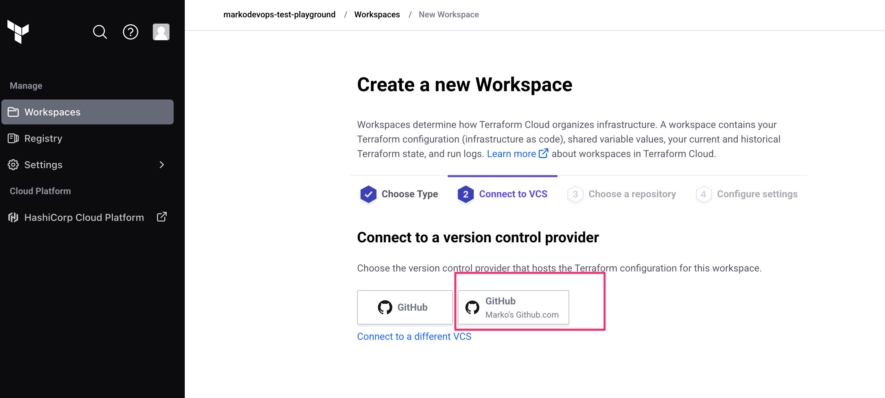
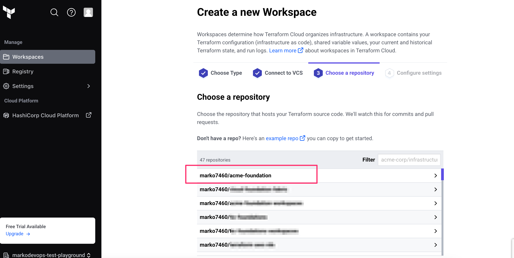
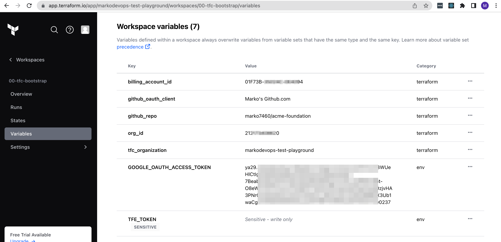
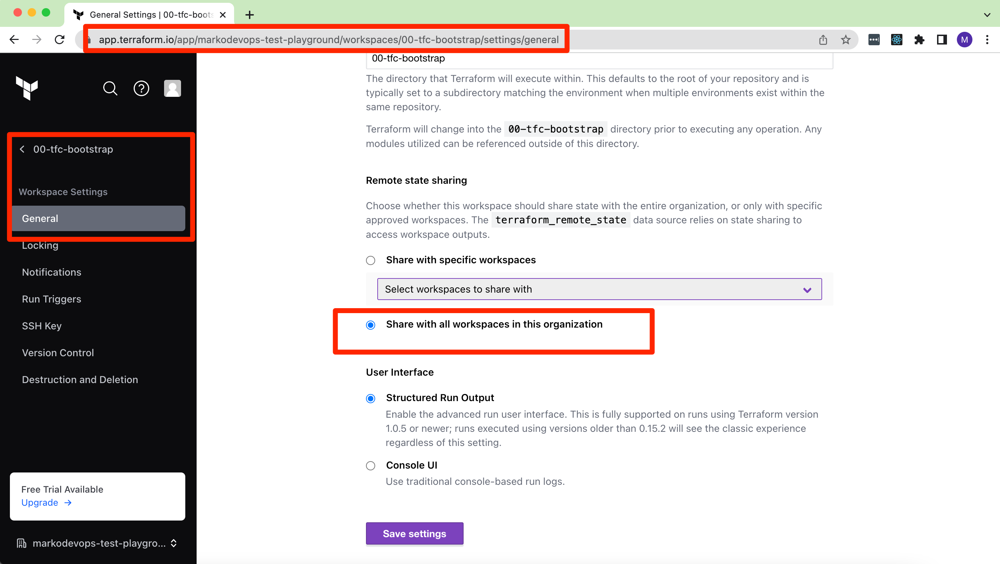

# acme-foundations
Example terraform foundation for imaginary ACME organization based on https://cloud.google.com/docs/terraform/best-practices-for-terraform
This example repository shows how you can deploy foundation resources (folders, projects, VPCs, etc.) in an organization.
This is a `green field` type of deployment that assumes that you are starting off with an empty organization and
a superadmin user. The goal of this repo is to deploy and manage all the resources using [Terraform Cloud](https://app.terraform.io/)
but the code can be easily adjusted for `Terraform Enterprise` as well.

Deployed architecture is simplified Dual SVPC architecture described in the [CFT terraform-example-foundation](https://github.com/terraform-google-modules/terraform-example-foundation)
This terraform code will deploy the following infrastructure:

# Use Cases
* You can use this project to bootstrap your new GCP organization with GCP recommended best practices
* You can use this project to create new foundation that follows the best practice while you are decomissioning old infrastructure
* If you need terraform code to be integrated with CI/CD and Github this project comes with all of it
* GitOps management of the deployed infrastructure.

# Scenarios
You can use this code for the following scenarions
1. As a DevOps team/organization you need to bootstrap GCP organization with best practices.
2. As a DevOps team/organization you need GCP resources to be managed via CI/CD system and GitOps workflow.
3. As a DevOps team/organization you need an easy way to changes infrastructure parameters.
4. As a DevOps team/organization you need an easy way to extend the foundation infrastructure. For example, you can easily add environments or subnets.

# Skill Level
* Basic knowledge of terraform workflows
* Basic knowledge of terraform syntax
* Basic knowledge of GCP Console UI and gcloud command

# Deployment Procedure
In the following steps we will demonstrate how this repo can be used with Terraform Cloud to _green field_ deploy foundation
resources without any code changes or any gcp service account keys needed. Everything will be done through the web browser
(Chrome). The code in this repository will set up **Workload Identity Federation** on GCP side in order to avoid crating any
service account keys. Furthermore, the GCP organization policies will be set in a way that prevents service account key
creation.

The following groups of steps will help you deploy the foundations in your organization. The steps are grouped in the
following way:
* [0 - Prerequisites](#0---prerequisites)
* [1 - Presetup](#1---presetup)
* [2 - Setup 00-tfc-bootstrap](#2---setup-00-tfc-bootstrap)
* [3 - Deploy the rest of the infrastructure](#3---deploy-the-rest-of-the-infrastructure)

## 0 - Prerequisites
Before starting the deployment you will need following:
1. [GitHub account](https://github.com)
2. [GCP account](https://console.cloud.google.com/) and organization setup with billing
3. [Terraform Cloud Account](https://app.terraform.io) with terraform organization and superadmin rights.

## 1 - Presetup
1. Fork this repo to your GitHub account
2. Go to Terraform Cloud and set up the GitHub provider following these instructions: https://developer.hashicorp.com/terraform/tutorials/cloud/github-oauth
3. Go to https://console.cloud.google.com/ and set up the superadmin user with the following roles granted on the 
   organization level(!!!This repo assumes that the operator deploying this account is the user logged into GCP console.
   You should have these roles assigned to you on the organizational level):
   1. Billing Account Administrator
   2. Compute Shared VPC Admin
   3. Folder Admin
   4. Folder IAM Admin
   5. Organization Administrator
   6. Owner
   7. Project Creator
   8. Project Lien Modifies
   9. Support Account Administrator
      1. 
4. Open the cloud shell (Open this in the new tab: https://console.cloud.google.com/?cloudshell=true)
5. Run `gcloud auth print-access-token` and save the value of the token. You will need this in the following section.

## 2 - Setup 00-tfc-bootstrap
This is the bootstrapping workspace that will create all other workspaces with proper variables and also bootstrap GCP with proper
TFC project, Workload Identity Federation, GCP Folders, and proper GCP automation service accounts.
1. Go to https://app.terraform.io/
2. Create workspace `00-tfc-bootstrap` with the following settings:
   1. Version Control Workflow
   2. For Version Control Provider use the provider that you set up in step 2 of [1 - Presetup](#1---presetup). Example: 
   3. Choose the clone of this repository. Example: 
   4. Set Workspace Name text field to **00-tfc-bootstrap**
   5. Press `Advanced Options` button
   6. Set `Terraform Working Directory` to **00-tfc-bootstrap**
   7. Press `Create Workspace`
   8. Press `Go to workspace overview button`
3. Create the following terraform variables for the `00-tfc-bootstrap`:
   1. `tfc_organization` -> Name of your terraform cloud organization
   2. `billing_account_id` -> GCP Billing Account ID.
   3. `org_id` -> Your GCP Organization ID
   4. `github_repo` -> Your clone of this repo
   5. `github_oauth_client` -> Name of the GitHub VCS Provider. You can get this value by going to 
      `https://app.terraform.io/app/<TFC_ORGANIZATION_NAME>/settings/version-control` See [this](docs/00-tfc-bootstrap-github_oauth_client.png) image for an example
4. Create the **environment variable** `GOOGLE_OAUTH_ACCESS_TOKEN` and set the value to the value obtained in the step 5 of [1 - Presetup](#1---presetup) 
5. Go to https://app.terraform.io/app/settings/tokens
6. Press `Create an API Token` button 
7. For description enter `workload-identity-federation` and press `Create API token`
8. Copy the value of the token and press `Done` (I would advise to save this value somewhere temporarily)
9. Go back to the `00-tfc-bootstrap` and create an **environment variable** `TFE_TOKEN` with the sensitive value from the
   previous step. Your variables should look like this 
10. Deploy the workspaces by pressing `Actions-Start new run` button. Once the plan is over you should see around 47
   resources to be created. Press `Confirm and Apply` button. 
11. Go to the `00-tfc-bootstrap` workspace settings and allow remote state sharing with all other workspaces. Example:
    
12. Go to the variables and delete the **environment variable** `GOOGLE_OAUTH_ACCESS_TOKEN`.

If everything went well you should see the following workspaces created in your terraform cloud organization:
* 01-cloud-administration-global
* 02-global-iam
* 03-org-policies
* 04-shared-services
* 05-hierarchical-firewall-policy
* 10-shared-vpc-projects-dev
* 10-shared-vpc-projects-stg
* 10-shared-vpc-projects-prd
* 20-shared-vpc-networking-dev
* 20-shared-vpc-networking-stg
* 20-shared-vpc-networking-prd
* 30-projects-dev
* 30-projects-stg
* 30-projects-prd

## 3 - Deploy the rest of the infrastructure
Execute the following workspaces in the following order:
1. 01-cloud-administration-global
2. 02-global-iam
2. 03-org-policies
3. 04-shared-services
4. 05-hierarchical-firewall-policy
5. 10-shared-vpc-projects-dev
6. 10-shared-vpc-projects-stg
7. 10-shared-vpc-projects-prd
8. 20-shared-vpc-networking-dev
9. 20-shared-vpc-networking-stg
10. 20-shared-vpc-networking-prd
11. 30-projects-dev
12. 30-projects-stg
13. 30-projects-prd

If everything went well you should have the following infrastructure deployed:

## 4 - Operation
If you want to change folder names the best way to do this is by changing variable `folders` in [00-tfc-boostrap/terraform.tfvars](00-tfc-bootstrap/terraform.tfvars).

If you need to change the values for certain parts of the infrastructure the best way to do this is by changing variables
in the `terraform.tfvars` files in the respective directories. For example, to add firewall rules, change [05-hierarchical-firewall-policy/terraform.tfvars](05-hierarchical-firewall-policy/terraform.tfvars).

If you need to expand this infrastructure template with new components then you need to create new TFC workspaces by chaging
the code in [00-tfc-boostrap](00-tfc-bootstrap).
