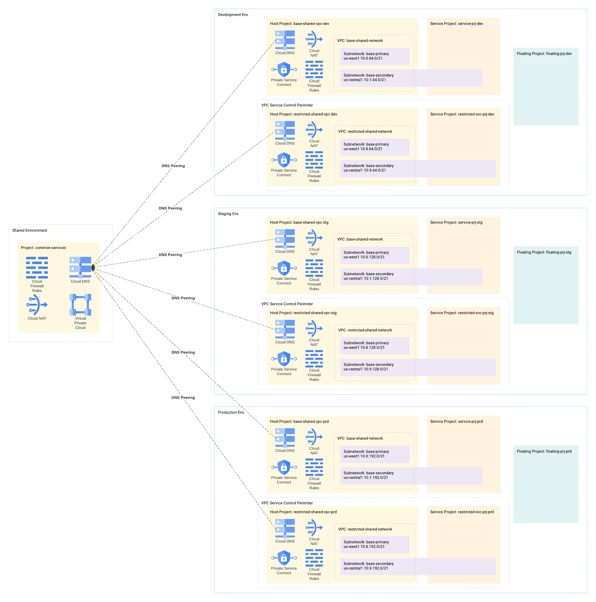
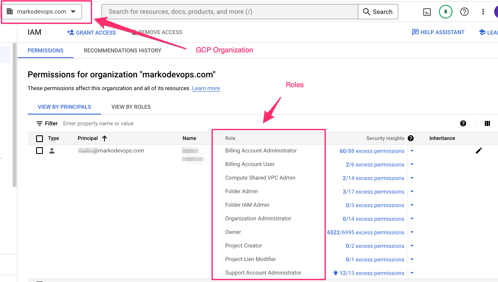
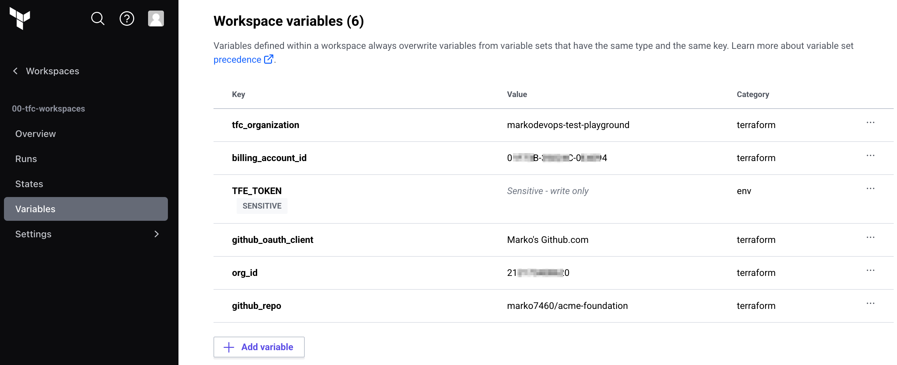
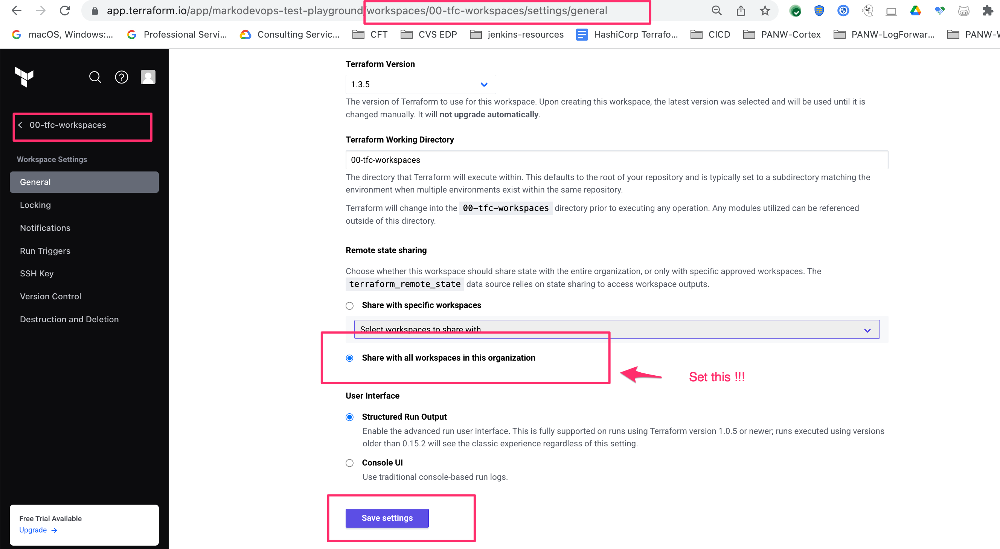
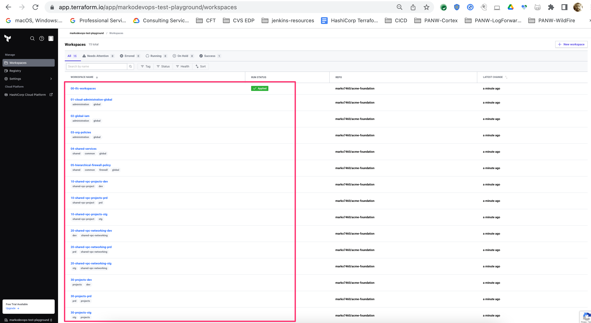
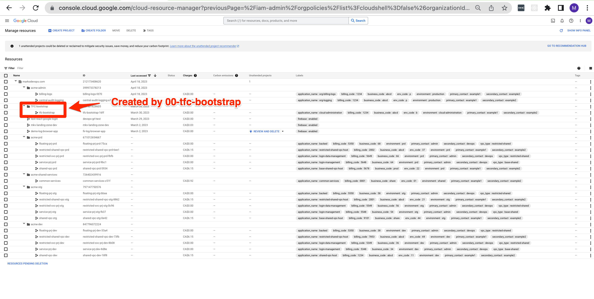

# acme-foundations
Example terraform foundations for imaginary ACME organization based on https://cloud.google.com/docs/terraform/best-practices-for-terraform
This example repository shows how you can deploy foundation resources (folders, projects, VPCs, etc.) in an organization.
This is a `green field` typo of a deployment that assumes that you are starting off with an empty organization and
superadmin user. The goal of this repo is to deploy and manage all the resources using [Terraform Cloud](https://app.terraform.io/)
but the code can be easily adjusted for `Terraform Enterprise` as well.

In the following steps we will demonstrate how this repo can be used with Terraform Cloud to _green field_ deploy foundation
resources without any code changes or any gcp service account keys needed. Everything will be done through the web browser
(Chrome). The code in this repository will set up Workload Identity Federation on GCP side in order to avoid crating any
service account keys. Furthermore, the GCP organization policies will be set in a way that prevents service account key
creation.

Deployed architectue is simplified Dual SVPC architecture described in the [CFT terraform-example-foundation](https://github.com/terraform-google-modules/terraform-example-foundation)
This terraform code will deploy the following infrastructure:

# Deployment Procedure
The following groups of steps will help you deploy the foundations in your organization. The steps are grouped in the
following way:
* [0 - Prerequisites](#0---prerequisites)
* [1 -Presetup](#1---presetup)
* [2 - Setup 00-tfc-workspaces](#2---setup-00-tfc-workspaces)
* [3 - Bootstrap the GCP environment](#3---bootstrap-the-gcp-environment)
* [4 - Deploy the rest of the infrastructure](#4---deploy-the-rest-of-the-infrastructure)

## 0 - Prerequisites
Before starting the deployment you will need following:
1. [GitHub account](https://github.com)
2. [GCP account](https://console.cloud.google.com/) and organization setup with billing
3. [Terraform Cloud Account](https://app.terraform.io) with terraform organization and superadmin rights.

## 1 - Presetup
1. Clone this repo to your GitHub account
2. Go to Terraform Cloud and set up the GitHub provider following these instructions: https://developer.hashicorp.com/terraform/tutorials/cloud/github-oauth
3. Go to https://console.cloud.google.com/ and set up the superadmin user with the following roles granted on the 
   organization level(!!!This repo assumes that the operator deploying this account is the user logged into GCP console.
   You should have these roles assigned to you on the organizational level):
   1. Billing Account Administrator
   2. Compute Shared VPC Admin
   3. Folder Admin
   4. Folder IAM Admin
   5. Organization Administrator
   6. Owner
   7. Project Creator
   8. Project Lien Modifies
   9. Support Account Administrator
      1. 

## 2 - Setup 00-tfc-workspaces
This is the bootstraping workspace that will create all other workspaces and variable sets in terraform cloud.
1. Go to https://app.terraform.io/
2. Create workspace `00-tfc-workspaces` with the following settings:
   1. Version Control Workflow
   2. For Version Control Provider use the provider that you set up in step 2 of [1 - Presetup](#1---presetup). Example: 
   3. Choose the clone of this repository. Example: 
   4. Set Workspace Name text field to **00-tfc-workspaces**
   5. Press `Advanced Options` button
   6. Set `Terraform Working Directory` to **00-tfc-workspaces**
   7. Press `Create Workspace`
   8. Press `Go to workspace overview button`
3. Create the following terraform variables for the `00-tfc-workspaces`:
   1. `tfc_organization` -> Name of your terraform cloud organization
   2. `billing_account_id` -> GCP Billing Account ID.
   3. `org_id` -> Your GCP Organization ID
   4. `github_repo` -> Your clone of this repo
   5. `github_oauth_client` -> Name of the GitHub VCS Provider. You can get this value by going to 
      `https://app.terraform.io/app/<TFC ORGANIZATION NAME>/settings/version-control` See [this](docs/00-tfc-workspaces-github_oauth_client.png) image for an example
4. Go to https://app.terraform.io/app/settings/tokens
5. Press `Create an API Token` button
6. For description enter `workload-identity-federation` and press `Create API token`
7. Copy the value of the token and press `Done` (I would advise to save this value somewhere temporarily)
8. Go back to the `00-tfc-workspaces` and create an **environment variable** `TFE_TOKEN` with the sensitive value from the
   previous step. Your variables should look like this 
9. Deploy the workspaces by pressing `Actions-Start new run` button. Once the plan is over you should see around 47
   resources to be created. Press `Confirm and Apply` button.
10. Go to the `00-tfc-workspaces` workspace settings and allow remote state sharing with all other workspaces. Example:
    

If everything went well you should see the following workspaces created in your terraform cloud organization:

## 3 - Bootstrap the GCP environment
In this procedure we will bootstrap the GCP environment by running the `01-cloud-administration-global` workspace. This
code will create initial admin projects, environment folders, terraform service accounts for other TFC workspaces with
proper IAM permissions. It will also set up the workload identity federation between GCP and TFC that will allow keyless
service accounts to be used in TFC workspaces.
1. go to https://console.cloud.google.com/ and activate the Cloud Shell
2. Execute `gcloud auth print-access-token` and copy the value of the token. See [this](docs/01-cloud-administration-global-gcloud-auth.png) image for an example
3. Go to https://app.terraform.io/app/<TFC ORGANIZATION NAME>/workspaces/01-cloud-administration-global/variables
4. Create an **environment variable** `GOOGLE_OAUTH_ACCESS_TOKEN` with the value of the token from the step 2. See [this](docs/01-cloud-administration-google-access-token-variable.png) image for an example.
5. Press `Actions->Start new run` button. Once the plan is over you should see around 150 resources to be created. Press `Confirm and Apply` button.
6. Once terraform apply is over you should see `workload_identity_audience` and `workload_identity_pool_provider_id` outputs created. Copy values for these variables. See [this](docs/01-cloud-administration-global-outputs.png) image for an example.
7. Go to https://app.terraform.io/app/<TFC ORGANIZATION NAME>/settings/varsets/
8. Press on `Workload Identity` variable set
9. Add terraform variable workload_identity_pool_provider_id with the value of the output `workload_identity_pool_provider_id` from the step 6. See [this](docs/workload-identity-variable-set.png) image for an example.
10. Add **environment variable** `TFC_WORKLOAD_IDENTITY_AUDIENCE` with the value of the output `workload_identity_audience`  from the step 6. See [this](docs/workload-identity-variable-set.png) image for an example.
11. Last step would be to go back to the `01-cloud-administration-global` workspace and set the variable `use_google_oath_token` to `false`.
    As a precautionary measure you can also delete the `GOOGLE_OAUTH_ACCESS_TOKEN` variable. Rerun the terraform plan.
    There shouldn't be any changes.

At this point you are set up to deploy the rest of the infrastructure.

## 4 - Deploy the rest of the infrastructure
Execute the following workspaces in the following order:
1. 02-global-iam
2. 03-org-policies
3. 04-shared-services
4. 05-hierarchical-firewall-policy
5. 10-shared-vpc-projects-dev
6. 10-shared-vpc-projects-stg
7. 10-shared-vpc-projects-prd
8. 20-shared-vpc-networking-dev
9. 20-shared-vpc-networking-stg
10. 20-shared-vpc-networking-prd
11. 30-projects-dev
12. 30-projects-stg
13. 30-projects-prd

If everything went well you should have the following infrastructure deployed:
